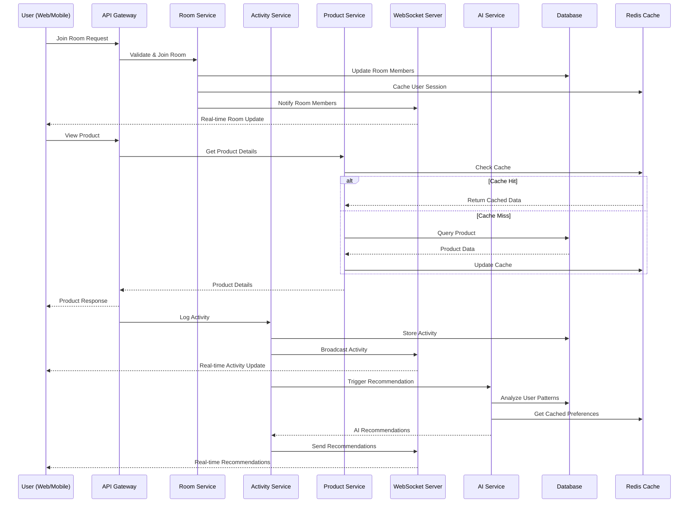
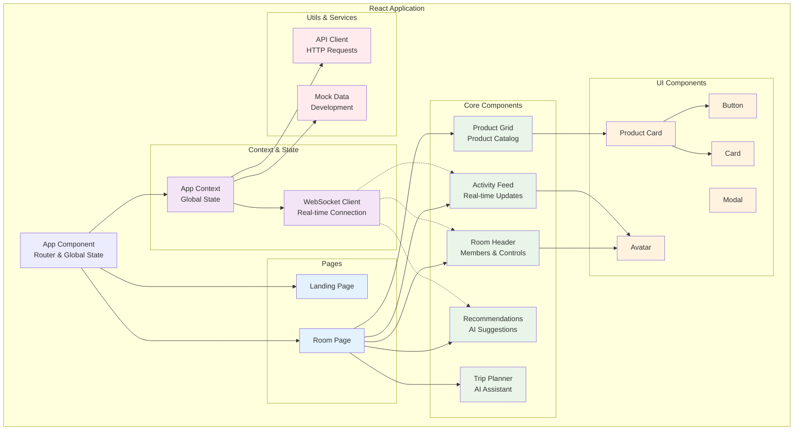
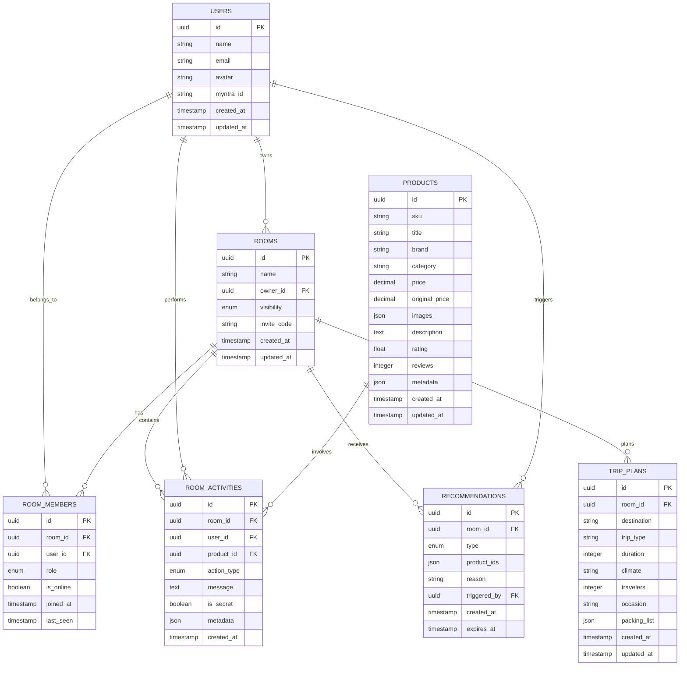
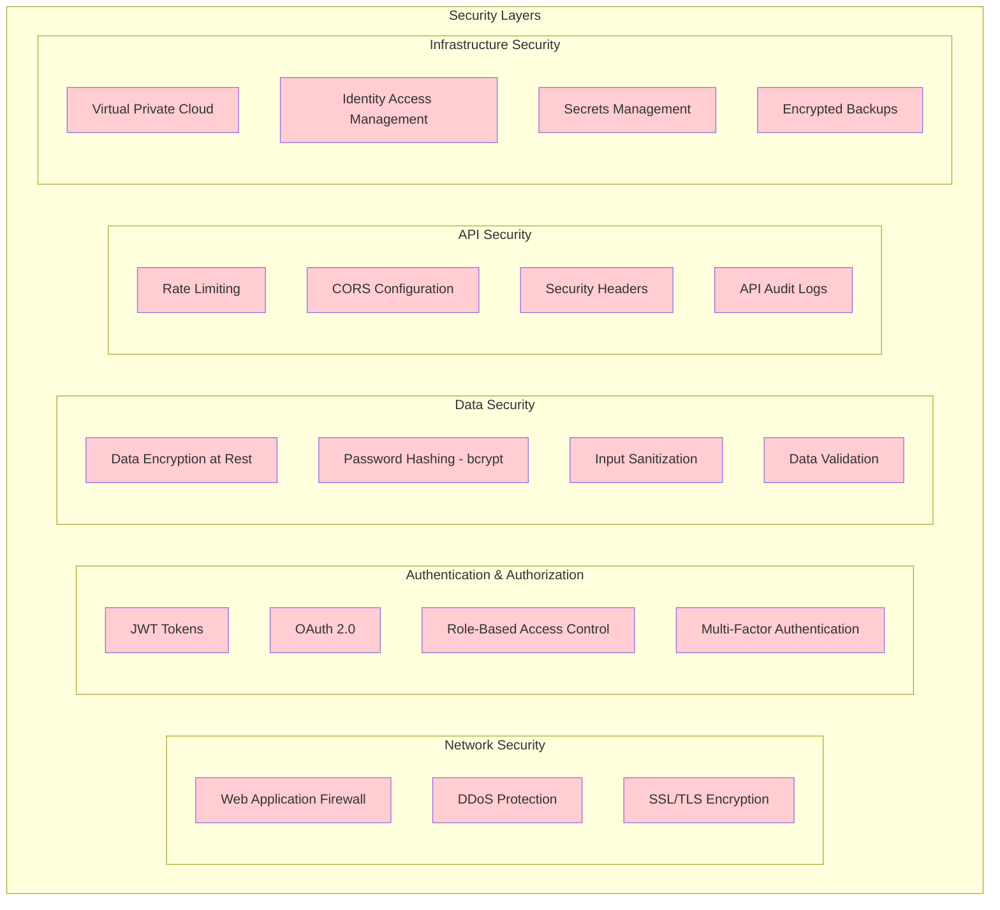
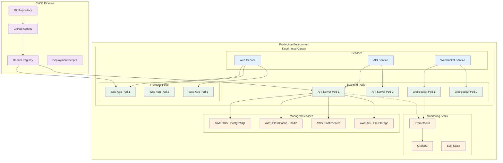

# Myntra Family Room - System Architecture

## High Level System Design

```mermaid
graph TB
    %% Client Layer
    subgraph "Client Layer"
        WEB[Web App - React/TypeScript]
        MOB[Mobile App - React Native]
        PWA[PWA - Progressive Web App]
    end

    %% API Gateway & Load Balancer
    subgraph "Gateway Layer"
        LB[Load Balancer - Nginx]
        AG[API Gateway - Kong/AWS API Gateway]
        CDN[CDN - CloudFront/Cloudflare]
    end

    %% Microservices Layer
    subgraph "Microservices Architecture"
        subgraph "Core Services"
            US[User Service<br/>Authentication & Profiles]
            RS[Room Service<br/>Room Management]
            PS[Product Service<br/>Catalog & Search]
            AS[Activity Service<br/>Real-time Activities]
        end
        
        subgraph "Business Services"
            AI[AI Service<br/>Recommendations & Trip Planning]
            NS[Notification Service<br/>Email/SMS/Push]
            PayS[Payment Service<br/>Transactions]
            SS[Search Service<br/>Elasticsearch]
        end
        
        subgraph "Integration Services"
            MS[Myntra Integration<br/>Product Sync]
            ES[External Services<br/>Payment/Email/SMS]
        end
    end

    %% Real-time Layer
    subgraph "Real-time Communication"
        WS[WebSocket Server<br/>Socket.io]
        RTC[WebRTC Signaling<br/>Video Chat]
    end

    %% Data Layer
    subgraph "Data Layer"
        subgraph "Primary Storage"
            PG[(PostgreSQL<br/>Main Database)]
            MONGO[(MongoDB<br/>Activity Logs)]
        end
        
        subgraph "Cache & Search"
            REDIS[(Redis<br/>Cache & Sessions)]
            ES_DB[(Elasticsearch<br/>Product Search)]
        end
        
        subgraph "File Storage"
            S3[(AWS S3<br/>Images & Files)]
        end
    end

    %% External Services
    subgraph "External APIs"
        MYNTRA[Myntra API<br/>Product Catalog]
        PAYMENT[Payment Gateway<br/>Razorpay/Stripe]
        EMAIL[Email Service<br/>SendGrid]
        SMS[SMS Service<br/>Twilio]
        OPENAI[OpenAI API<br/>AI Recommendations]
    end

    %% Monitoring & Analytics
    subgraph "Monitoring"
        LOGS[Logging<br/>Winston/ELK Stack]
        METRICS[Metrics<br/>Prometheus/Grafana]
        ERROR[Error Tracking<br/>Sentry]
    end

    %% Connections
    WEB --> CDN
    MOB --> CDN
    PWA --> CDN
    
    CDN --> LB
    LB --> AG
    
    AG --> US
    AG --> RS
    AG --> PS
    AG --> AS
    AG --> AI
    AG --> NS
    AG --> PayS
    
    WEB -.-> WS
    MOB -.-> WS
    PWA -.-> WS
    
    US --> PG
    US --> REDIS
    
    RS --> PG
    RS --> REDIS
    RS --> WS
    
    PS --> PG
    PS --> ES_DB
    PS --> REDIS
    PS --> MS
    
    AS --> MONGO
    AS --> REDIS
    AS --> WS
    
    AI --> OPENAI
    AI --> PG
    AI --> REDIS
    
    NS --> EMAIL
    NS --> SMS
    NS --> REDIS
    
    PayS --> PAYMENT
    PayS --> PG
    
    SS --> ES_DB
    
    MS --> MYNTRA
    ES --> PAYMENT
    ES --> EMAIL
    ES --> SMS
    
    %% File uploads
    WEB -.-> S3
    MOB -.-> S3
    
    %% Monitoring connections
    US -.-> LOGS
    RS -.-> LOGS
    PS -.-> LOGS
    AS -.-> LOGS
    
    US -.-> METRICS
    RS -.-> METRICS
    PS -.-> METRICS
    AS -.-> METRICS
    
    US -.-> ERROR
    RS -.-> ERROR
    PS -.-> ERROR
    AS -.-> ERROR

    %% Styling
    classDef client fill:#e1f5fe
    classDef gateway fill:#f3e5f5
    classDef service fill:#e8f5e8
    classDef data fill:#fff3e0
    classDef external fill:#ffebee
    classDef monitoring fill:#f1f8e9
    
    class WEB,MOB,PWA client
    class LB,AG,CDN gateway
    class US,RS,PS,AS,AI,NS,PayS,SS,MS,ES,WS,RTC service
    class PG,MONGO,REDIS,ES_DB,S3 data
    class MYNTRA,PAYMENT,EMAIL,SMS,OPENAI external
    class LOGS,METRICS,ERROR monitoring
```

## Data Flow Architecture

## Component Architecture (Frontend)

## Database Schema Overview

## Security Architecture

## Deployment Architecture

## Key Features & Data Flow

### 1. Real-time Collaboration
- WebSocket connections for instant updates
- Activity broadcasting to all room members
- Online/offline status tracking
- Synchronized product viewing

### 2. AI-Powered Recommendations
- Machine learning based on user behavior
- Trip-specific product suggestions
- Collaborative filtering within family groups
- Smart packing list generation

### 3. Secret Mode
- Hidden activity tracking
- Private gift shopping
- Selective visibility controls
- Surprise element preservation

### 4. Scalability Features
- Microservices architecture
- Horizontal pod autoscaling
- Database sharding capabilities
- CDN for global content delivery

### 5. Security Measures
- End-to-end encryption for sensitive data
- JWT-based authentication
- Rate limiting and DDoS protection
- Comprehensive audit logging

This architecture supports high availability, scalability, and real-time collaboration while maintaining security and performance standards suitable for a production e-commerce platform.
